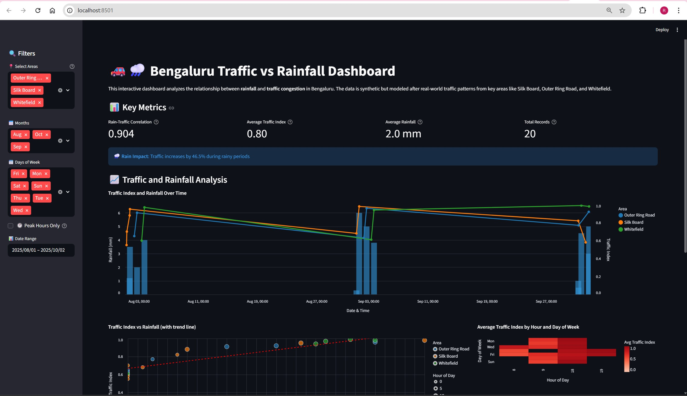
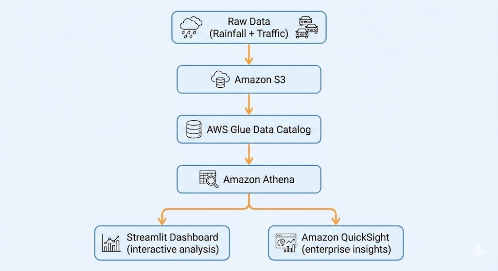
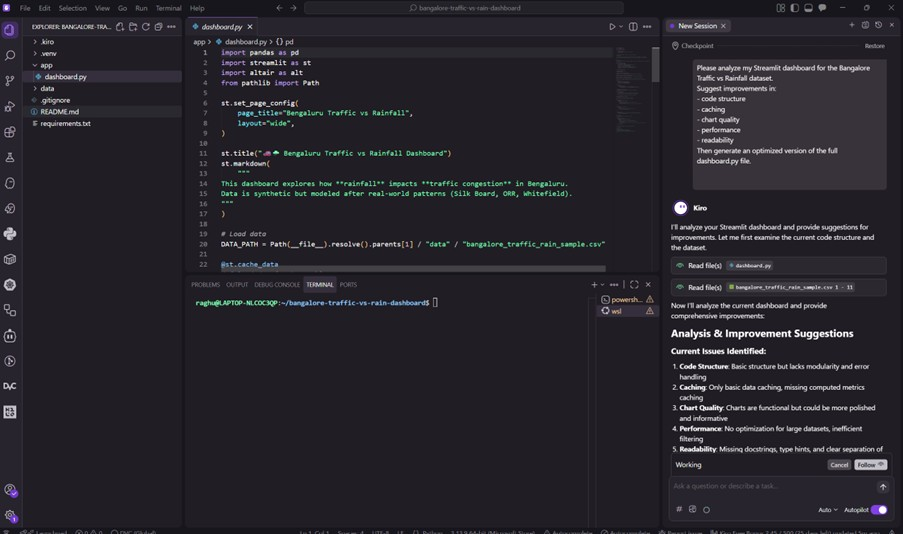
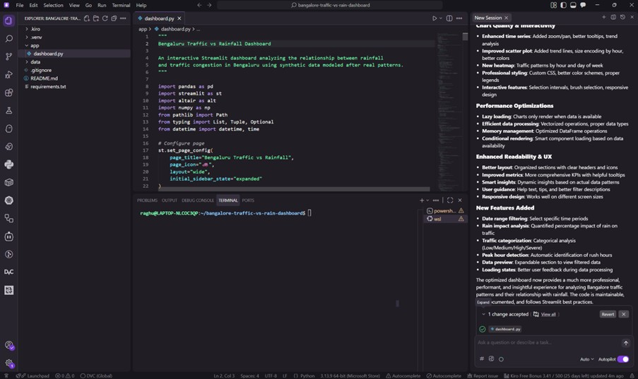

# Bengaluru Traffic vs Rainfall – Data Weaver Dashboard

This project is my submission for **Kiro Week 3 – The Data Weaver**.

It combines two data sources:
- Hourly **rainfall**, and  
- Hourly **traffic congestion index**

…to visualize how badly Bengaluru traffic gets impacted when it rains.

### Features
- Filters by area, month, and day-of-week  
- Peak-hours toggle  
- Correlation metric  
- Combined rainfall + traffic time series  
- Rain vs traffic scatter visualization  

### Dashboard Preview
Bengaluru Traffic vs Rainfall — Interactive Streamlit Dashboard
(Synthetic data modeled after real congestion patterns in Silk Board, ORR, and Whitefield)




### Data Flow Diagram:



### Kiro Prompting Workflow (How this project was built)
<p float="left">
  
  
</p>

## Tech Stack

- Python
- Streamlit
- pandas + altair
- (Kiro) used to scaffold the app + tweak charts

### Run Locally

```bash
pip install -r requirements.txt

streamlit run app/dashboard.py
